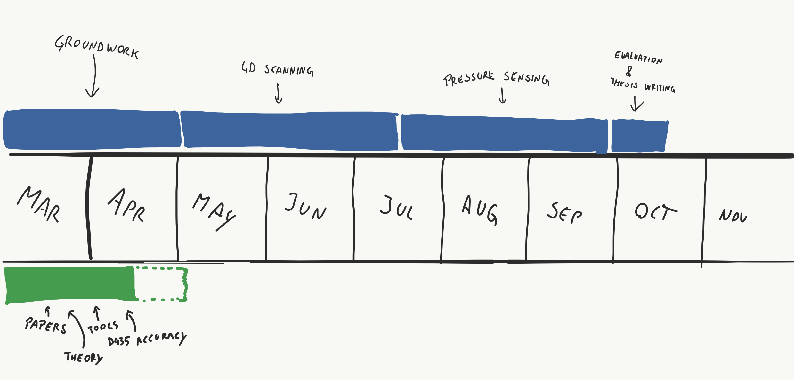
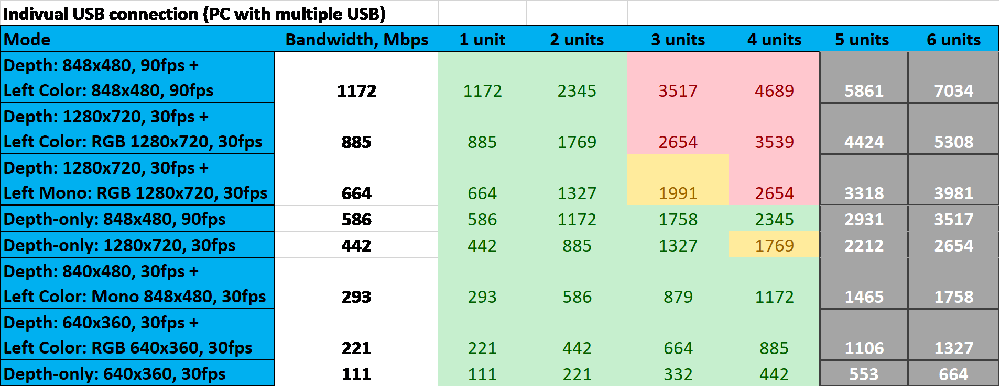
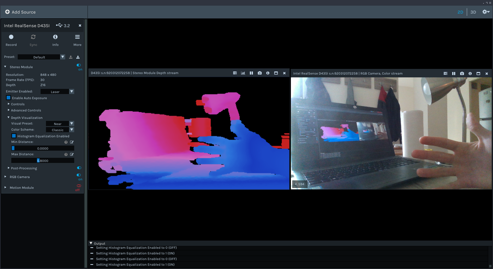
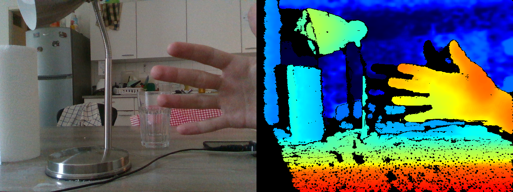

# 4DFS UPDATES @26.03

I want to keep you updated with my 4D foot scanner project, so I will be sending this kind of reports more regularly  (every two weeks approximately). Any kind of feedback is welcome.

## Roadmap

Project status. Planned timeline is in blue, actual progress is in green.

## Progress report

Since our first group meeting on 3rd of March, I was mostly focusing on three things: *papers*, *theory* and *tools*. In this "groundwork" phase of the project my goal is to learn basic concepts of 3D scanning and computer vision, gather relevant papers and resources and to familiarize myself with hardware (RealSense camera) and software (RealSense SDK, OpenCV, etc.).

### Papers

In the beginning I was (trying to) read papers about 4D and 3D foot scanning specifically, but quickly realized that I need to start elsewhere in order to get an **overview of the field**. Aiming for breadth rather than depth, I want to highlight a few papers which will serve as a springboard for further research:

1. [Dynamic 3-D shape measurement method: A review][1]

   Useful as an overiew of dynamic 3D methods, their categorization and use-cases, terminology and basic principles. However many use-cases presented in the paper are probably not to our scenario (such as membrane vibrations, high-speed rotating objects etc.).

   

2. [State of the Art on 3D Reconstruction with RGB-D Cameras][2]

   Probably <u>the most useful</u> and relevant paper at this point of time. Provides an overview of 3D scanning and reconstruction using RGB-D (color + depth) cameras, which is exatly what we are working with. I used this paper to create a "study to-do" list of all relevant computer vision topics and to find other relevant papers.

3. [Registration of 3D Point Clouds and Meshes: A Survey from Rigid to Nonrigid][3]

   Since we are using the RealSense depth camera at the moment, data acquisition might not be the main concern. One of the challenges is precisely and automatically aligning point-clouds captured from multiple cameras. This paper provides an overview of relevant methods, which will be useful in the next phase of the project. More recent techniques should be explored as well (this paper is from 2013).

4. [Intel® RealSense™ Stereoscopic Depth Cameras][4]

   Overview of the RealSense RGBD camera systems, theory of operation and performance of the R200 family of cameras. Our camera is newer, but main principles of operation are the same.

5. [Metrological and Critical Characterization of the Intel D415 Stero Depth Camera][5]

   One of the main questions we want to answer in the early phase is whether our RealSense D435 camera is appropriate for the task - is it accurate enough? Pointed to by prof. Wolf, this paper investigates accuracy of a very similar camera from the same RealSense family.

6. [A state-of-the-art review of foot pressure][6]

   Overview of foot pressure measuring techniques and tools. Will be useful in later phases of the project.

Before diving deeper into research I need to learn enough theoretical fundamentals to understand the papers above well, which is something I was working on recently.

[1]: https://www.sciencedirect.com/science/article/abs/pii/S014381660900075X
[2]: https://www.researchgate.net/publication/325488173_State_of_the_Art_on_3D_Reconstruction_with_RGB-D_Cameras
[3]: https://ieeexplore.ieee.org/document/6361384/citations?tabFilter=patents
[4]: http://openaccess.thecvf.com/content_cvpr_2017_workshops/w15/html/Keselman_Intel_RealSense_Stereoscopic_CVPR_2017_paper.html
[5]: https://www.mdpi.com/1424-8220/19/3/489
[6]: https://www.sciencedirect.com/science/article/pii/S1268773118300857

### Theory

I dedicated significant amount of time studying basic concepts of computer vision, 3D scanning and reconstruction. In order not to "waste" too much time on theory, I created a list of topics that were frequently discussed in the papers mentioned above:

> triangulation, fringe projections, affine transformations, phase unwrapping, noise reduction, bilateral filters, RANSAC, ICP, signed distance fields, image rectification, epipolar geometry ...

Some online courses and videos which I found useful:

- [William Hoff's Computer Vision course](https://www.youtube.com/playlist?list=PL4B3F8D4A5CAD8DA3) 

  Computer Vision theory explained with short videos (searchable by topic) in a "human-friendly" way.

- [Multiple View Geometry in CV by Sean Mullery](https://www.youtube.com/playlist?list=PLyH-5mHPFffFvCCZcbdWXAb_cTy4ZG3Dj)

  Course dedicated for Autonomous Vehicle engineering students, concise overview of 3D imaging related concepts with very practical explanations.

- [Computer Vision for Visual Effects by Rich Radke](https://www.youtube.com/playlist?list=PLBvTHNwPbOAMWMVEAk5rvRoAIguPD7fmF)

  Nice introduction to structured light scanning, 3D from stereo and registration. Simple explanation of Epipolar geometry and stereo correspondence.

I covered approximately half of the mentioned topics, but it is hard to quantify this as the reading list is an ever-growing living organism.

Another thing I looked into is USB protocol and its capacity. This [whitepaper](https://dev.intelrealsense.com/docs/multiple-depth-cameras-configuration) presents experiments regarding USB bandwidth requirements of RealSense camera. In short, it will not be possible to use more than four cameras on single USB host controller interface. This indicates that we could take distributed computing solutions into consideration in the future.

*USB bandwidth requirements example, from the mentioned [whitepaper](https://dev.intelrealsense.com/docs/multiple-depth-cameras-configuration)* 

### Tools

In the last week I shifted my focus from papers and theory more torwards hands-on experience. Biggest part of this was setting up the camera-related toolchains, reading documentation and getting familiar with relevant libraries (OpenCV) .

*Intel RealSense Viewer software*

**Installing the camera software** seemed trivial at first and I could play with the RealSense Viewer software within minutes (image above). However, some other tools which could be useful ([DepthQuality](https://github.com/IntelRealSense/librealsense/tree/master/tools/depth-quality) tool, FirmwareUpgrade) did not work and I decided to spend some time (~2 days) on compiling and installing libraries properly. Maybe this could be avoided, but I was really interested in learning that and also it will be useful when porting the system to various embedded computers. The linux documentation project was helpful in learning about [program libraries](http://tldp.org/HOWTO/Program-Library-HOWTO/index.html).

Despite some documentation online, I found [RealSense github](https://github.com/IntelRealSense/librealsense) to be the best source of information ([code examples](https://github.com/IntelRealSense/librealsense/tree/master/examples ), [documentation](https://github.com/IntelRealSense/librealsense/tree/master/doc ), [useful tools](https://github.com/IntelRealSense/librealsense/tree/master/tools )). 

Finally I was able to compile and run examples, both in **C++** and **Python**. At this point, I managed to write a short code example for capturing and vizualizing both color and depth images.

*Images taken with a custom python script*

## What's next?

My main objective now is determining the **accuracy of the camera**, so we can decide if it is appropriate for the project. This involves measuring its Field Of View, Z-accuracy, Plane-fit RMS error etc. 

I will be referencing to the [D415 characterization paper](https://www.mdpi.com/1424-8220/19/3/489/xml) and perform simplified measurements on our, D435 camera model. At the moment I am planning to use DepthQuality tool, but also custom python scripts to compare the results (and to understand measurements better).

> **Note:** since I have to take three exams in the coming exam period, I will now dedicate more time for studying, so I can focus on graduation project exclusively in the future. I suggest scheduling next meetings after the examination days are known and fixed.

