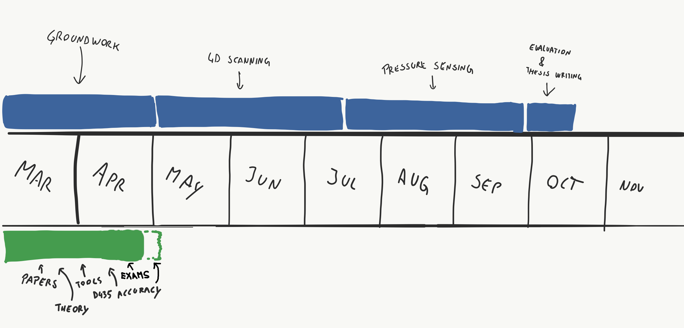
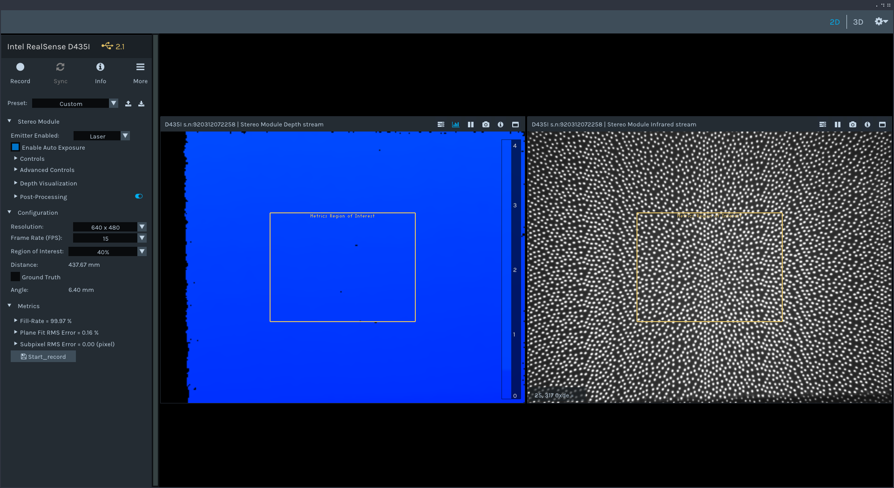
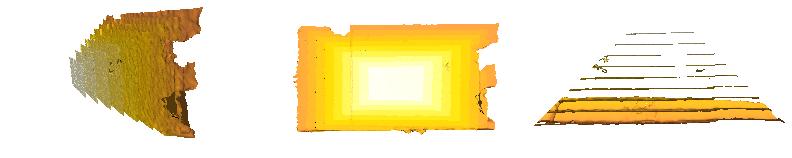
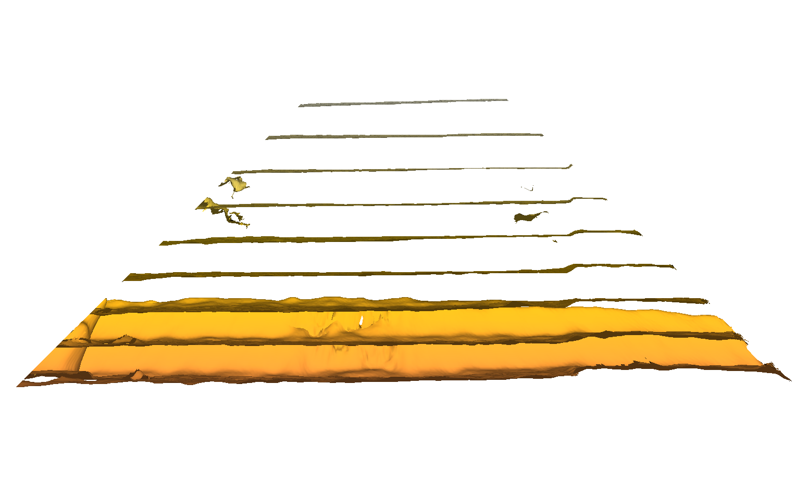
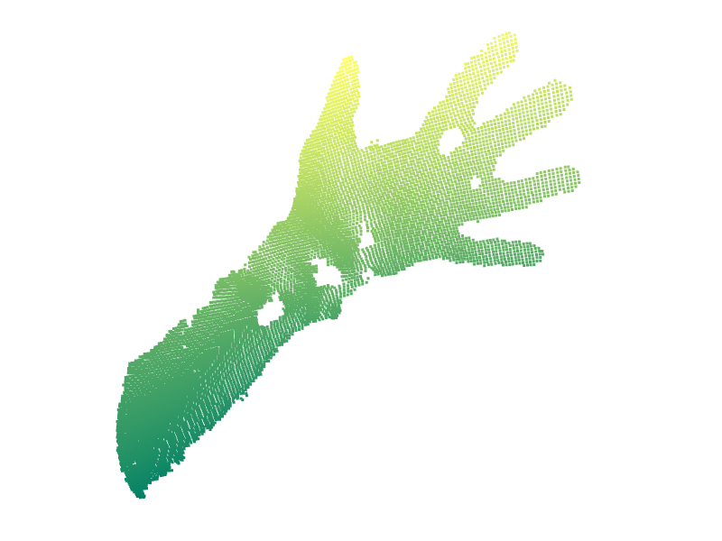

# 4DFS UPDATES @20.04

## Roadmap

## Progress report

In the last few weeks I mostly focused on exams, which went great (I passed both of them)!

I conducted the **first accuracy measurement** test, using Intel RealSense Depth Quality tool. I used the following papers as guidelines:

- [Metrological and Critical Characterization of the Intel D415 Stero Depth Camera](https://www.mdpi.com/1424-8220/19/3/489 ) 
- [Tuning depth cameras for best performance](https://dev.intelrealsense.com/docs/tuning-depth-cameras-for-best-performance)

My goal was to measure **systematic planarity errors** at different distances from the sensor (in other words, if we measure a flat surface, how homogenous/flat is the obtained data). Image below shows my setup, which is a first attempt, serving mostly for educational purposes.

  

*Setup of the experiment*

*RealSense Depth quality tool*

Data was measured in range of 300 - 1100 mm with a pitch of 100mm. Metrics offered in Depth quality tool are: Fill-rate [%], Plane-fit RMS error [%], Subpixel RMS error [%]. 

Due to circumstances and lack of appropriate tools (and experience :) ) I consider this test very inaccurate, but I learned a lot from it. Results are shown below 

**Default preset**, auto-exposure (setpoint at 1536). Laser power (default) 150mW. Resolution 848 x 480 px, 40 FPS, 40% ROI.

| distance | fill-rate | plane-fit RMS | subpixel RMS |
| -------- | --------- | ------------- | ------------ |
| 30       | 99.99     | 0.16          | 0.05         |
| 40       | 100       | 0.17          | 0.04         |
| 50       | 100       | 0.20          | 0.04         |
| 60       | 100       | 0.15          | 0.02         |
| 70       | 100       | 0.28          | 0.04         |
| 80       | 100       | 0.17          | 0.02         |
| 90       | 100       | 0.32          | 0.03         |
| 100      | 100       | 0.19          | 0.02         |
| 110      | 100       | 0.36          | 0.03         |

*at 110 reaching the edge of the doors (wall area too small for larger distances)

**High accuracy preset**, other settings are the same

| distance | fill-rate | plane-fit RMS | subpixel RMS |
| -------- | --------- | ------------- | ------------ |
| 30       | 100       | 0.19          | 0.05         |
| 40       | 100       | 0.17          | 0.03         |
| 50       | 100       | 0.20          | 0.04         |
| 60       | 100       | 0.30          | 0.05         |
| 70       | 100       | 0.24          | 0.03         |
| 80       | 100       | 0.17          | 0.02         |
| 90       | 100       | 0.39          | 0.04         |
| 100      | 100       | 0.18          | 0.02         |
| 110      | 100       | 0.41          | 0.03         |

*Visualization of captured planes at different distances (using MeshLab)*

There are several things that could be improved or I want to ask about:

- I know **lighting** is relatively bad. Is there anything I could do better?
- **autoexposure yes/no**? If yes, should I keep it constant across measurements, or adapt at every new distance?
- I was measuring data only in the **ROI** of 40% (default setting of DepthQuality tool). I am guessing that it makes sense to measure accuracy accross whole frame.
- Camera **perpendicularity** against the wall. Not consistent across measurements, is this a problem?

---

Apart from that, I also tried **programming** my own "depth quality tool", to learn how to work with pointclouds, python and relevant libraries.

These the steps I managed to achieve with small python programs:

- obtain and display depthmap, colormap, infraredmaps + export `.ply` files
- create UI which shows camera stream (RGB) and captures depth image on button press
- visualize pointclouds (using Open3D library)

*Pointclound rendered with custom script (using Open3D library)*

## What's next?

Next step on my TODO list is **calculating best-fit plane**. Surprisingly I could not find a straightforward and simple solution in any of the libraries (OpenCV, Open3D) - am I missing something obvious?

Realsense implementation of Depth Quality tool uses [this method](https://www.ilikebigbits.com/2015_03_04_plane_from_points.html) . Other potential methods:

- PCA ([article](https://cerebralmastication.com/2010/09/principal-component-analysis-pca-vs-ordinary-least-squares-ols-a-visual-explination/) explaining difference between PCA and Ordinary Least Squares)
- Total least-squares, SVD
- RANSAC
- ~~Hough transform~~

I am now working torwards understanding the mathematics and implementing one of those methods.

