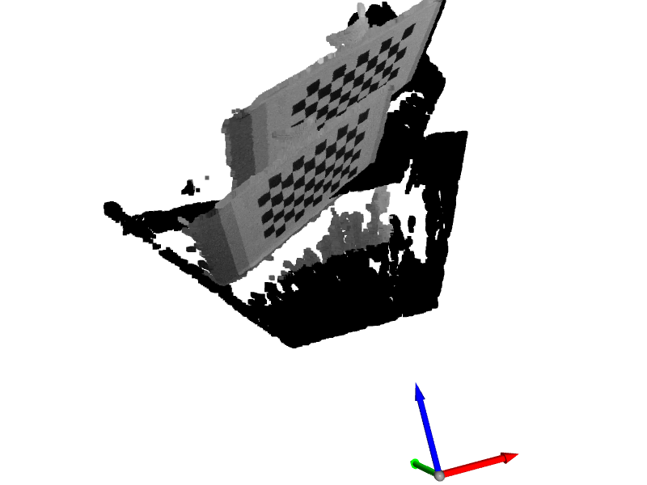
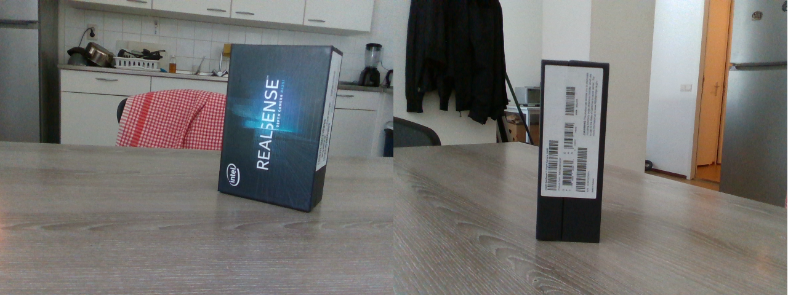
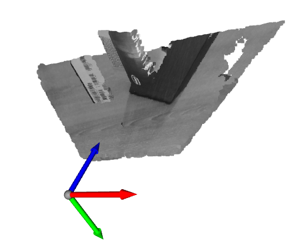

# 4DFS UPDATES @25.06

## Roadmap

## Progress Report

### D435i accuracy results

Approximately one month ago (20.5), I presented my RealSense D435i accuracy measurement [results](https://jurc192.github.io/4DFS_updates/accuracy_report). Few weeks after that, I also presented the same results on [IDE3D meeting](https://docs.google.com/presentation/d/1IcfBUQFqLq2_Ht7OzpDzGTo0GqXxqrKSaOafd2qeKXY/edit?usp=sharing). Some conclusions I got from the feedback and reflecting back:

- good learning experience, understand theory better, handling the camera
- results not too reliable but good enough to prove the point -> **camera is good enough** for the task (sub 0.1 mm RMSE errors, below 1m)

- after repeating the measurements, I believe we will have a good characterization of the camera
- **tangible conclusions were not really drawn** in the first test:
  - did not <u>prove</u> that 848x480 px is the best resolution (but I 'know'/believe it)
  - optimal exposure + laser power settings are <u>not obvious</u> from the graphs/results
  - did not determine what <u>ROI</u> (Region of Interest) to use - how many border pixels should we throw away due to noise? 

Drawing those tangible conclusions is important for the project, since ROI (and FoV, not measured previously) + optimal distance will determine minimal **number of cameras** needed.

### Registration

One of the most important parts of this project, is registration of multiple 3D scanned pointclouds - how to align scans from multiple cameras into a single coordinate frame?

- the problem of registration is not new, and already 'solved' -> I need to pick the best way and implement it. Note to self: <u>do not re-invent the wheel</u>!
- got lost in the topic, since many fields (robotics, computer vision etc.) deal with essentially the same problem in different contexts: *registration, visual odometry, structure from motion, camera pose estimation, multi-cam calibration....*

- learned about ICP algorithm, tried implementing it on my own scans (unsuccessfully) and on the [Redwood RGBD](http://redwood-data.org/3dscan/) dataset (semi-successful)
- upon discussing with prof. Wolf, I realised that ICP is **not really needed at this phase** of the project. Simpler, coarser alignment is needed and sufficient for now.

- after some time researching and finding myself in the topic, I finally chose my approach: use **classic camera calibration** techniques - use the extrinsic parameters to obtain camera positions and transformations between them
  

### Multi-cam extrinsic calibration

[Camera calibration](https://en.wikipedia.org/wiki/Camera_resectioning) is a process of estimating the camera parameters (pinhole camera model). Commonly a **checkerboard** is captured with a camera -> calibration process tells us multiple things: *focal length, sensor/pixel sizes, principal points* (intrinsics) as well as *<u>coordinate system transformation between the world and the camera</u>* (extrinsics). We set one of the chessboard corners as the origin of the world, with X and Y axes on the board, Z axis pointing outwards.

The idea is to:

- scan a well known calibration object (chessboard, ArUco markers, etc.) - visible by all cameras
- get extrinsic parameters for each camera (calibration process)
- calculate relative transformations between cameras (thanks Yusheng for help with maths!)
- use this in all subsequent scans, for registering the pointclouds (hard-stiching?). This way we only calibrate once, then use the transformations in all subsequent scans. Really convenient and fast.
- the question is: **how accurate is this**? How can we improve it?

I decided to implement a simple version of this, for the sake of learning and getting insight. Answering the accuracy question will be easier after first implementation is done.

Using OpenCV and chessboard **I am able to calibrate and get relative transformation between two cameras** and consequentially registering two point clouds.
However, I am not sure if the results are 100% correct just yet - wondering how far can this technique bring us?  

Image 1: Unaligned scan of a chessboard, from two cameras.

Image 2: aligned scan

There was a great deal of debugging so far:

- **RealSense SDK multi-camera issues**. However, final release of the SDK works (enough for this purpose, cameras not hw synchronised yet)
- my own misunderstandings of the 3D transformations and algorithms, etc.

During the process I also learned about aligning RGB image to depth image and vice-versa. This fixed the problem which I had - color data was not mapped correctly to the pointcloud in the beginning Shown below.

 

Image 3,4 : original color images from two realsense cameras. misaligned mapping between color frame and the depth frame (pointcloud)

In the future, I want to **evaluate this technique** (answer the accuracy question) and relate what I am doing to scientific research. One of the papers I want to look into is this: [Robust Intrinsic and Extrinsic Calibration of RGB-D Cameras](https://ieeexplore.ieee.org/document/8423784) (**2018**, [implementation](http://iaslab-unipd.github.io/rgbd_calibration/) in ROS).

## What's next?

First thing that I want to achieve is **better registration**, by:

- fixing/optimizing my implementation w/ chessboard
- using ChArUco markers (more convenient usage, not sure about greater accuracy)
- fine-grained alignmennt using ICP or something similar
- calibrate all cameras (intrinsics), also IR/depth - now using factory intrinsics, RGB only.

I am aiming to do this in the next week. 
After that I want to do in parallel:

- determine optimal number, settings and positions of cameras
- embedded system design
  - theoretical/measured USB bandwidth requirements
  - PCI bus capabilities - how many USB controllers can we have on a single motherboard = how many cameras. Can we leave some PCI bandwidth reserved for GPU (parallel computing, acceleration)?

Thinking about if I should **proceed with prototype design** in one of two ways:

1. Do it the careful and smart way
   - repeat the accuracy measurements first
   - obtain optimal settings = optimal number of cameras = optimal positions
   - only then proceed to buying/designing hardware
   - PROS: seems more right, spending money will be argumented, nicer for writing the thesis
     CONS: might take a lot of time before reaching embedded design (feels late already) -> no time for reflecting and improving the system. Most likely this means doing it in one go, on the first try.
2. Just do it and pray
   - start embedded stuff right after next week
   - design a system that can support 6-8 cameras using 848x480 resolution (most likely used)
   - measure bandwidths in practice
   - select, buy and assemble the hardware asap
   - PROS: learning by doing, gain experience by building prototype version 1 - use this knowledge in the second iteration, for improving it. Second time, I will 'know what I am doing'.
     CONS: harder to argument (not good for thesis writing), might buy some parts that are not optimal/needed, might overprovision the design....