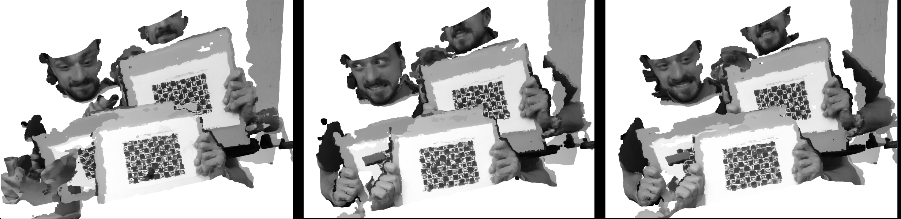
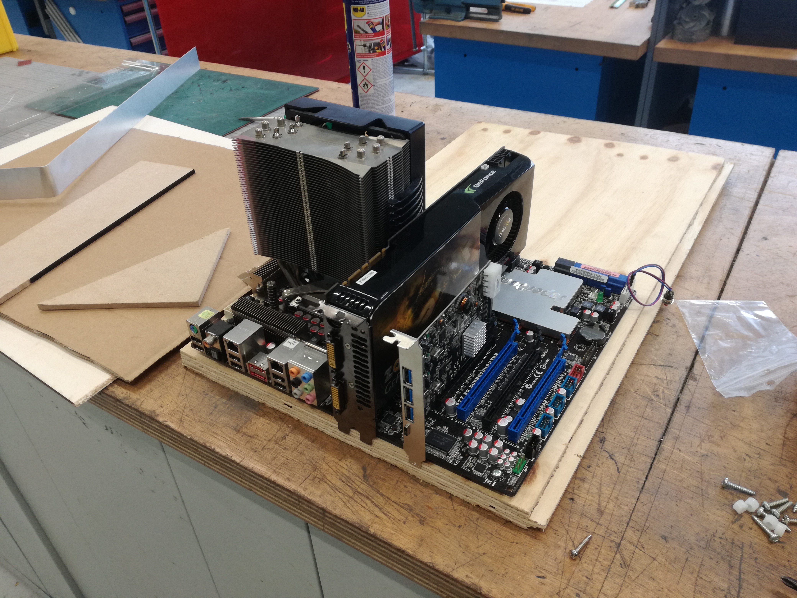
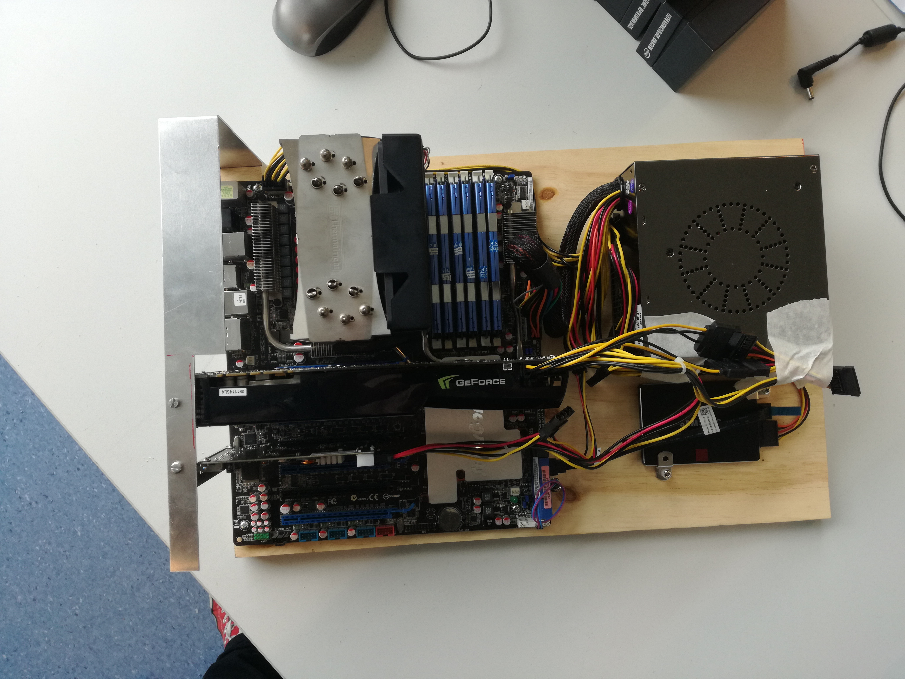
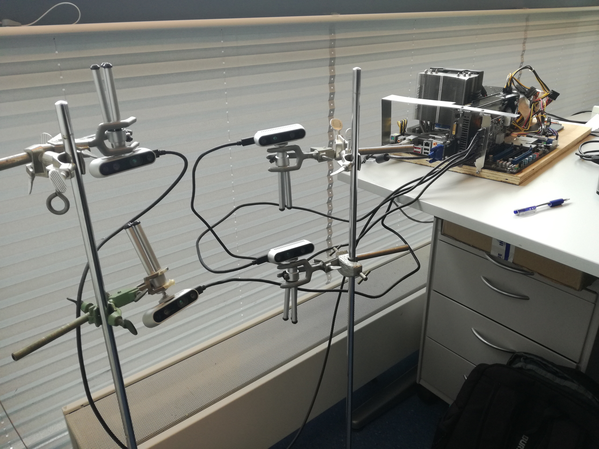
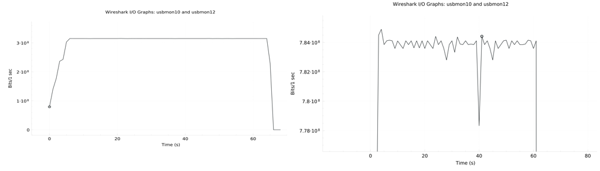

# 4DFS UPDATES @26.08

## Roadmap

(coming soon...)


## Progress report

- Since last meeting on 26.06 many ups and downs
- Most of the points from previous 4DFS updates were fulfilled!
  - calibration using ChArUco board
  - assembled the computing platform, with a high-end USB 3.1 card
  - bandwidth considerations & measurements
  - better insight into the "embedded" part of the system (hardware, OS, drivers)
- Multiple previously unpredicted challenges were solved:
  - pairwise calibration of cameras
  - RealSense issues and bugs
  - rewriting data acquisition software from Python to C++


### Where are we now?

We have a centralized, offline-processing, 4D scanning platform supporting 4 cameras, streaming RGB + DEPTH data at 6 FPS with resolution of 848x480 pixels



...and an implementation bug at extrinsic calibration :) *








Image 1: *Computing platform assembly, first prototype of the 4D foot scanner*


### Biggest challenges

- everything stopped working just one week before the presentation (which I cancelled last month)
  - different behaviour on **different USB Host controller cards**/manufacturers (Intel vs ASMedia)
  - eventually found a workaround (**resetting the USB drivers**/re-enumerating cameras every time)
- compiling libraries (OpenCV, RealSense, etc.)


## Bottleneck hunt

Theoretical bandwidths required for a single camera:

- Color stream w/ resolution 848 x 480 px and  **RGB8 (24-bit per pixel)** pixel format
- Depth stream w/ resolution 848 x 480 px and **Z16 (16-bit per pixel)** pixel format

| FPS  | BANDWIDTH                                                    |
| ---- | ------------------------------------------------------------ |
| 6    | 98 Mbps               <= 848 * 480 * (16-bit + 24-bit) * 6 FPS   = 97689600 bps |
| 15   | 244 Mbps             <= 848 * 480 * (16-bit + 24-bit) * 15 FPS = 244224000 bps |
| 30   | 488 Mbps             <= 848 * 480 * (16-bit + 24-bit) * 30 FPS  = 488448000 bps |

Using **four cameras at 6 FPS**, all frames are captured (requires **391 Mbps**).
Using **four cameras at 15 FPS**, only 69% of frames are captured (requires **977 Mbps**).
Where is the problem?

```
[ USB ] ---- [ CPU ] ---- [ DISK ]
```


Theoretical USB 3.1 bandwidth capacity: 5000 Mbps

Measured USB bandwidth (using Wireshark) @6 FPS: **315 Mbps** (out of 391 theoretical)
Measured disk writing speeds (using iotop) @15 FPS: **208 Mbps** (out of 391 theoretical) 

Measured USB bandwidth (using Wireshark) @15 FPS: **784 Mbps** (out of 977 theoretical)
Measured disk writing speeds (using iotop) @15 FPS: **384 Mbps** (out of 977 theoretical) 

CPU utilization is very high in both cases. Not sure how to measure it (yet).

My questions are: 

- why differences between theoretical and measured speeds? (specially USB. Disk writing can be slower due to OS/RAM buffering)
- @6FPS, how come I get all frames despite the fact that the measured USB/disk writing speeds are slower than the theoretical bandwidth? (<u>compressed transport format?</u> bad measurement approach?)



Figure 1: *Wireshark USB capture results at 6 FPS (left) and 15 FPS (right)*


## What's next?

1. Fixing the calibration bug, scanning a foot and celebrating the 4D foot scanner prototype version 1 :)

2. Evaluating the accuracy of the current scanner implementation
3. Pinpointing the bottleneck - USB, CPU or DISK
4. Experimental design/implementation of a distributed system (using RPi's)
5. Depending on those experiments:
   - distributed system implementation OR
   - centralized system re-design, second iteration
6. Returning to calibration/accuracy tests, optimal acquisition parameters, fancier registration techniques etc.