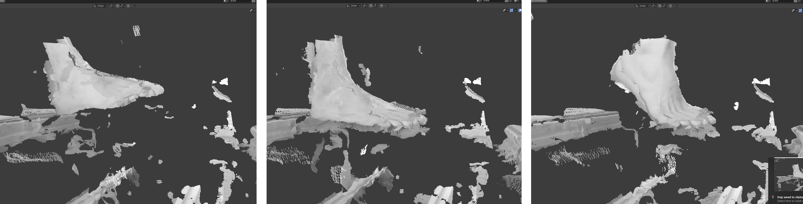
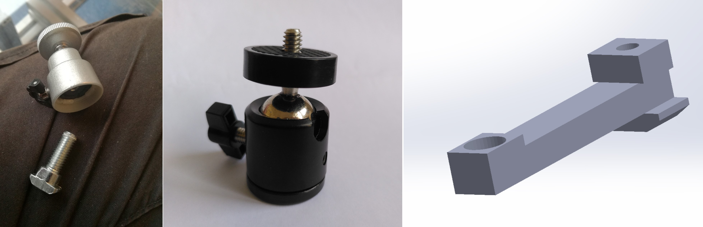

# 4DFS UPDATES @16.10

## Roadmap

## Progress report

In the last month and a half I was focused on two things:

- finishing the first scanner prototype
- making RealSense camera work on a Raspberry Pi + SSD

Finally, we have a 4D foot scanner prototype which involves a walking platform with a glass section and a camera frame. First foot scans were obtained using 4 cameras connected to a single computer, capturing at 6 FPS and resolution of 848 x 480 px.

Since I want to try implementing the system in a distributed manner, I was also testing RealSense cameras on Raspberry Pi computers. The idea is to create independent modules (camera + RPi + SSD disk) which can be wirelessly connected to a central computer - allowing for a more scalable and flexible architecture.

## Scanning results

*Image 1: three frames, extracted from a 4D scan sequence. This is the raw output of the scanner, coarsely aligned (using charuco calibration), but otherwise unprocessed pointclouds.*

The foot looks very noisy and alignment is far from perfect. However, output from individual cameras is not completely disastrous.

*Image 2: A single frame, taken with 4 cameras, displayed individually. Relative to the walking direction: front-right, front-left, back-left, and back-right camera views. This is 3D data (textured pointclouds).* 

*Image 3: Mesh deviation between my scan of the 3D printed hand and a original (reference) model. Average deviation 0.5mm, maximum deviation ~5mm. Before putting the results, I want to confirm that my methodology of evaluation is correct (using Geomagic Design X software).*

I noticed that the scans look cleaner when I ignore some of the camera's. Furthermore, often the front cameras captured most of the subject while the back cameras did not contribute much (but noise).  This is a quick observation that definitely needs more attention and camera positioning should be refined.

*Image 4: combined output of 4 cameras (left), only front pair of cameras (center), only back pair of cameras (right)*

## First 4D foot scanner prototype

### Walking platform

*Image 5: the walking platform (stage)*

The walking platform is made from *T-slotted aluminum extrusion profiles*, *multiplex* wood panels and *acrylic* sheet (plexiglass). Biggest challenge was selecting the glass: I tried 8mm thick plexiglass first, but it was bending too much and did not feel safe. Currently I use a 12mm plexiglass which feels much safer, but still bends a little bit.

> NOTE: I would like to look into tempered glass solutions, but I would need to consult with material experts - which unfortunately I could not find.

### Camera mounts

Cameras are mounted on aluminum extrusions with a ball-head camera mount and a 3D printed part which fits into the T-slots of the aluminum profile. Ball-head mount is actually taken from the original stand which is included with RealSense, but it is going to be replaced due to poor quality.

*Image 6: original RealSense ball-head camera mount (left), better mount replacement (center), 3D printed part for T-slotted profile which mounts the camera mount and a locking screw (right)*  

*Image 7: Top-down view of the camera frame*

*Image 8: Four RealSense cameras mounted on the camera frame, under the plexiglass.* 

> NOTE: One of design goals was to make the frame flexible (adapting position of cameras), but sturdy enough when tightened. In reality, changing the set-up is slightly annoying. Any suggestions?

### Scanning setup

*Image 9: Experimental setup with 4 cameras on the bottom side and LED panels for more consistent lighting conditions*

## Raspberry Pi tests

### Boot from SSD

First challenge was to boot Raspberry Pi from an SSD (rather than an SD-card) via USB3. This feature is officially not released yet, but there are testing firmware releases and several blog posts / tutorials.
The SSD enclosure (connecting the NVME M.2 SSD disk with the USB3 interface) had a buggy chipset which was disrupting the boot process. Discussing with RPi firmware developers helped me find the ~~solution~~ workaround.

### RealSense performance

I compiled the RealSense SDK and tested the camera. I could get 100% at 15 FPS and less than 60% on 30 FPS. I am suspecting that the bottleneck is my python implementation of the software, so I will perform more tests with C++. 

I also looked into python profilers and found which parts of my code are running slowly. However, the bottleneck pinpointing is still not crystal clear. 

## What's next?

1. Writing a Hardware X paper and thesis drafts
2. Scheduling a green light meeting as soon as I have something to show (draft of the report)
3. Waiting for the second SSD enclosure to arrive, performing synchronization tests with Raspberry Pi computers
4. Improvements of the scanner setup, mechanical improvements, camera positions, lighting, etc.

