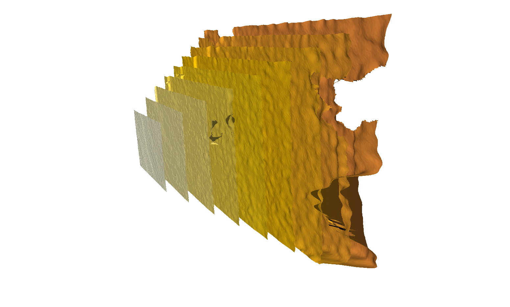
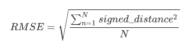
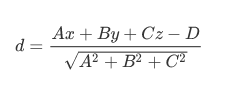
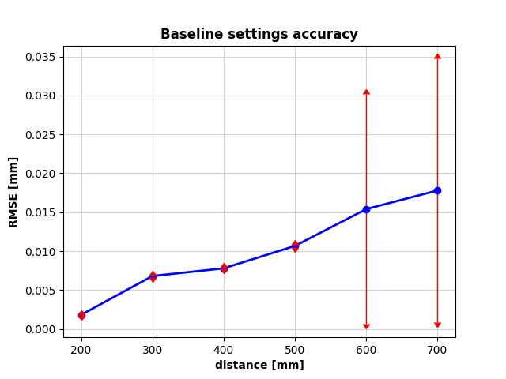
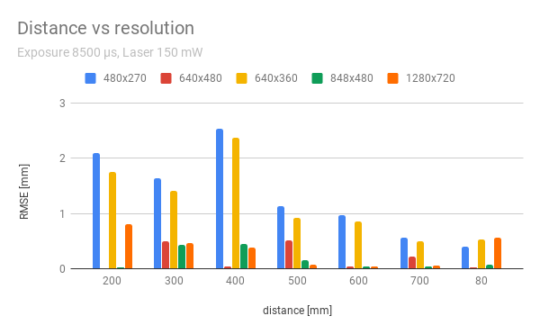
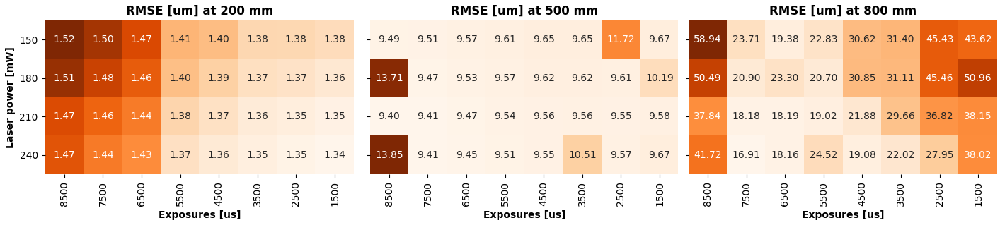
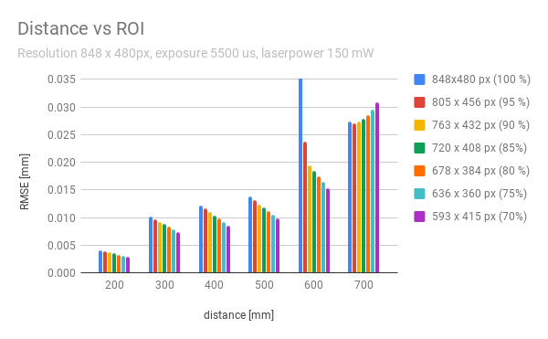
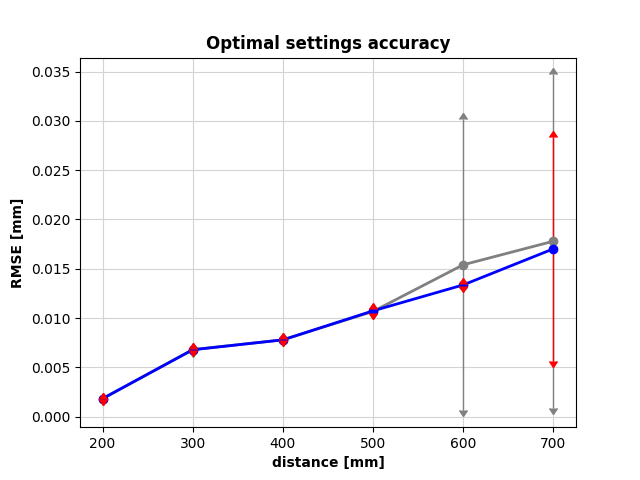

# RealSense D435i camera testing

## Introduction

In the first phase of the 4D foot scanner development, we evaluated the accuracy of the Intel RealSense D435i depth camera, which is considered a suitable candidate for the job. 

We are interested how the D435i depth camera performs at distances up to 1m. Current 3D foot scanners can provide accuracy in the range of 0.3mm [[1]()] which is enough for characterizing the human foot [[2]()], so we will consider anything below this threshold to be sufficiently accurate for our application.

## Depth camera errors

There are two kinds of systematic errors which are characterizing the camera's performance: depth offset and depth inhomogenity [[3]()]. **Depth offset** (or depth-accuracy, absolute error) is the difference between the measured depth values and actual depth values. **Depth inhomogenity** (or spatial noise, non-uniformity) is the variation of depth values across pixels, when measuring a planar (flat) target [[4]()].

To vizualise depth camera errors, we placed the camera perpendicularly against a flat surface (wall) and took measurements at increasing distances. The first (leftmost, brightest) plane is a depthmap captured at distance 200 mm from the wall. Measurements were taken in steps of 100 mm, with the rightmost depthmap at distance of 1 meter.

*Figure 1: Qualitative evaluation of errors, noise, increasing with distance. Each plane on the image is a depthmap, captured between distances 200 mm (left) and 1000mm (right), using default settings.*

## Measurement methods

In order to asses the accuracy of the RealSense D435i depth camera, we measure its depth inhomogenity, by placing a camera against a wall and taking depth measurements at increasing distances. Due to the circumstances and lack of precise instrumentation we do not measure depth offset. Experiment setup can be seen in the image below. 

*Figure 2: Experiment setup. A camera is placed on a box, facing the wall. Measuring tape is placed on the ground to estimate distance of the camera from the wall. Lighting environment is controlled and does not change across measurements (withing a single experiment).*

For each measurement we calculate the **root-mean square error (RMSE)** shown in formula below, using signed distances between a wall and measured points, in millimeters. Ideal depth camera measuring a perfectly flat plane would have RMSE of 0 mm.

*Formula 1: Root mean square deviation*

Since misaligning the camera would bias the results, we first calculate **best-fit plane** and compute RMSE using distances from best-fitted plane, rather than relying on ground truth [4]. Calculating the best-fit plane is performed using [linear regression](https://scikit-learn.org/stable/modules/linear_model.html#linear-model), minimizing the sum of squared distances between the plane and data points. Formula for calculating the distance between the best-fit plane and a point is shown below.

*Formula 2: Distance between a point (x, y, z) and a plane (A, B, C, D)*

## Experiments

The depth camera has a stereo pair of **near-infrared monochromatic cameras** (OV9282 sensor) and an **infrared projector** (850 +- 10 nm wavelength class 1 laser), which enables operation even in dark environments using active texture projection [5]. There is also a RGB camera, which we did not use in our experiments. 

We first determined which resolution provides best accuracy at distances 200mm, 500mm and 800mm. Then, we investigate which combination of exposure and projector laser power works best at those distances. Finally, we compare baseline settings with our obtained optimal settings in range between 200mm and 700mm, with 100mm steps. 

### Baseline settings

The default settings of the D435i camera are the following:

| Resolution [px] | Exposure [μs] | Laser power [mW] |
| --------------- | ------------- | ---------------- |
| 848 x 480       | 8500          | 150              |

From the graph below we can observe that in the whole range 200 - 700mm the RMSE values are **lower than 0.02 mm** which is well below our threshold of 0.3 mm. Standard deviations increase up to 0.017 mm (95%) at distances above 600 mm, which seems suspicious but reamins unexplained. Each datapoint is an average RMSE calculated over 50 frames.

*Figure 3: RMSE at increasing distances, using baseline settings: resolution 848 x 480 px, exposure 8500 μs, laser power 150 mW*

### Resolution

In order to find the best resolution for our application, we took the baseline settings and measured the accuracy using every available resolution at distances 200, 500 and 800 mm from the wall. In general, higher resolution should provide greater accuracy, but as it turns out the resolution of 848 x 480 px is optimal. This confirms the statement of official RealSense quality tuning document that the **resolution of 848 x 480 px is indeed optimal** for D435i camera model.

*Figure 4: RMSE at increasing distances using different resolutions. Default resolution (848 x 480 px, green) is optimal in the whole range.*

*NOTE: this results might be unreliable since RMSE was calculated for a single frame at every distance (unlike others, where an average of 50 frames was taken to reduce the effect of random noise.*

### Laser power and Exposure time

Next, we explored how increasing the IR projector's laser power affects the accuracy and which exposure time works the best. This two parameters are evaluated together, since one might affect another. Using short exposure times with high laser powers might increase SNR, specially in circumstances where sunlight or other sources of near-infrared light are present and might interfere with the projected pattern. This can be observed in the graph below, for the closest distance. When the camera is further away, exposure time needs to be increased to provide better accuracy. **Higher laser power results in higher accuracy, while a medium exposure time works well for all distances. **Combination of highest laser power (240 mW) and 6500 μs exposure is taken as the optimal candidate across all distances.

*Figure 5: Varying laser power and exposure time at increasing distances, using default resolution 848 x480*
*NOTE: RMSE units are in micrometers, for readability (otherwise in millimeters, troughout this document)*

[Link to high-resolution plot](https://drive.google.com/file/d/1nbClLTT0lfxiUVPvzEBqh6dDQtNBR3Vz/view?usp=sharing)

### Region of interest

Due to the lens distortion effects, the errors are increasing with distance from the image center. To observe how significant are those errors at the edges of depth images, we measured RMSE on different regions of interest, by cropping the image borders. Smaller region of interest (center-aligned rectangular area of the image) should provide better results, since the noisy pixels at the edges of images are discarded. Figure below indeed **shows the trend, where smaller ROI results in a smaller error** (with an outlier at 600 mm and the opposite pattern at 700 mm, probably due to  measurement errors). Taking a 90% region of interest (763 x 432 px) seems like the best option, for all distances in this range.

*Figure 6: Effect of cropping the image (discarding edge pixels) on accuracy. Smaller ROI results in smaller errors.*

*NOTE: this results might be unreliable since RMSE was calculated for a single frame at every distance (unlike others, where an average of 50 frames was taken to reduce the effect of random noise). Furthermore, exposure is not set to default value (8500 μs).* 

### Optimal settings

Finally, we repeated the measurements at distances 200mm to 700mm with 100 mm steps, using optimal settings:

| Resolution [px] | Exposure [μs]   | Laser power [mW] |
| --------------- | --------------- | ---------------- |
| 848 x 480       | ~~8500~~   6500 | ~~150~~   240    |

In the figure below, we can observe slight improvement in performance at higher distances, but the overall accuracy is similar to the baseline. This calculations were performed using 100% of the frame and could possibly be improved by using a smaller ROI. Each datapoint is an average RMSE calculated over 50 frames.

*Figure 7: RMSE at increasing distances, using optimal settings. Comparison with baseline (in gray) shows slight improvement at larger distances.*

## Conclusions

Given experiments show that the RealSense D435i depth camera **can provide sufficient accuracy** for our application at distances below 700 mm, since the **systematic error (spatial noise) is smaller than 0.02 mm**.

## References

[1]  : https://www.researchgate.net/publication/243484409_High-speed_measurement_of_foot_shape_based_on_multiple-laser-plane_triangulation 

[2]  : https://www.researchgate.net/publication/323671836_Three-dimensional_quantitative_analysis_of_healthy_foot_shape_A_proof_of_concept_study 

[3]  : https://ieeexplore.ieee.org/document/7929364 

[4]  : https://www.intel.com/content/dam/support/us/en/documents/emerging-technologies/intel-realsense-technology/RealSense_DepthQualityTesting.pdf 

[5]  : https://arxiv.org/abs/1705.05548 